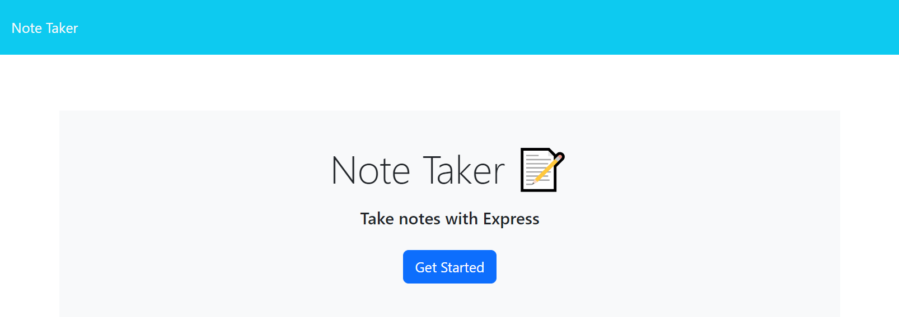
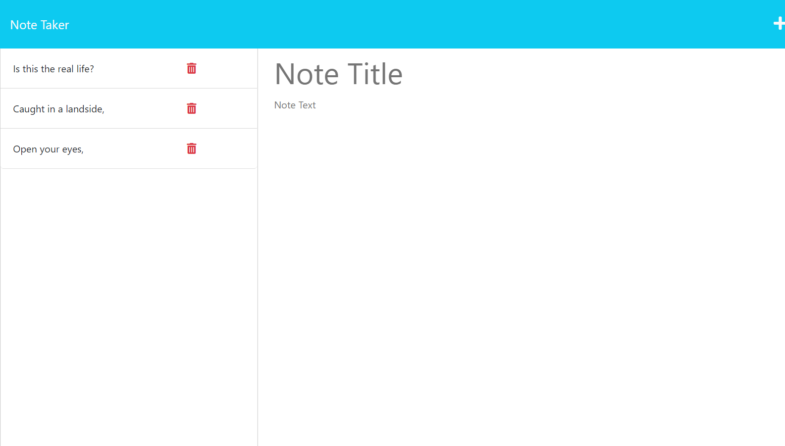
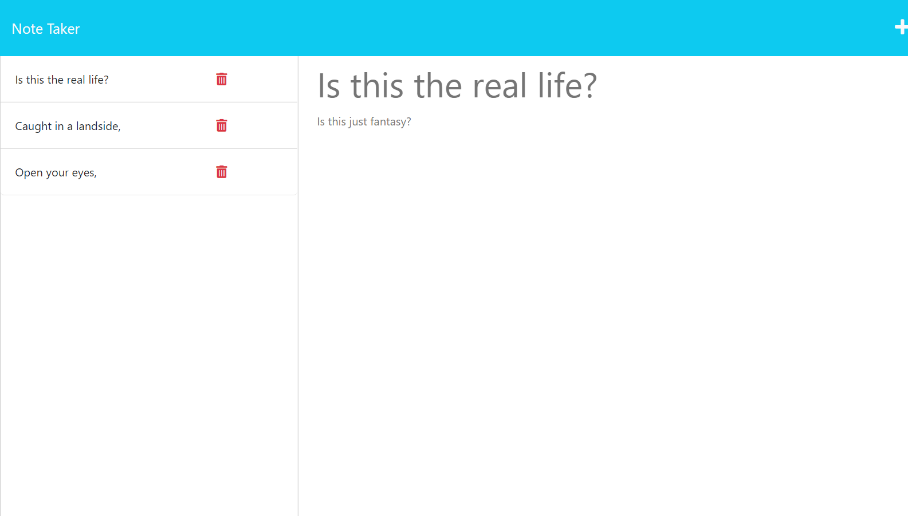

# Note Taker

[Link to My Project via Heroku](https://rocky-oasis-67925.herokuapp.com/notes)

## Table of Contents
- [Description](#description)
- [Instructions](#instructions)
- [License](#license)
- [Visuals](#visuals)

## Description 
This application is used to write and save notes.

Features Include:
- TEXT HERE

## Instructions
- Press "Get Started" on the home page to view past notes and/or add new notes.
- To add a new note, press the "+" in the upper right corner and type in "Note Title" and "Note Text" areas. 
- To view an old note, click on a Note Title on the left side of the screen, if present. 
- To delete an old note, click on the respective red trash can icon.
- To go back to the home page, click on "Note Taker" in the upper left hand corner. 

## Visuals 

The following is a gif demoing the application:

The following is a screenshot of the main page:

The following is a screenshot of the base notes page:

The following is a screenshot of the notes page with a past note presenting :

